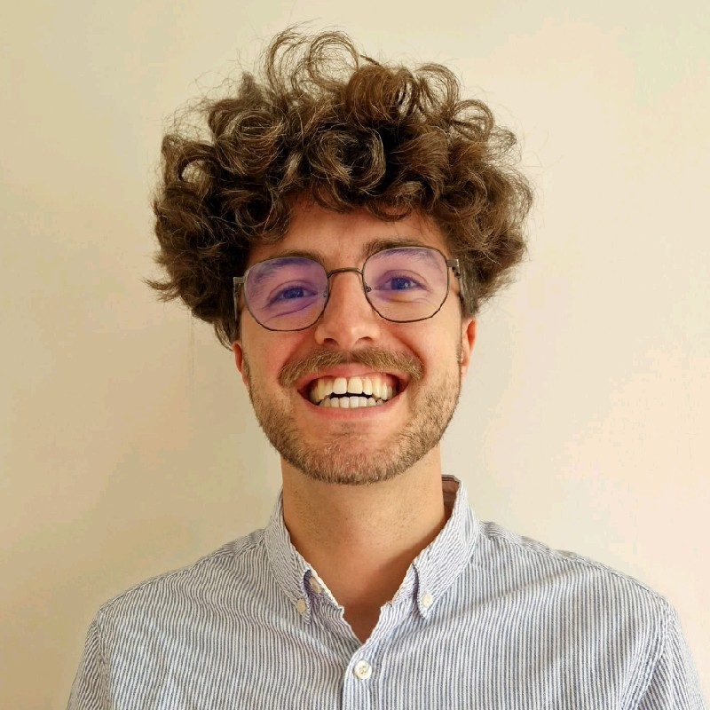

:::: {.hero-grid}

::: {.hero-photo-col}
{.hero-img}
:::

::: {.hero-text-col}
::: {.hero-name}
Antoine Lucas
:::

::: {.hero-tagline}
R / Shiny Developer · Scientific Software & Data Products
:::

::: {.hero-location}
Paris
:::

::: {.hero-links}
[ Email](mailto:antoine.lucas.fra@gmail.com){.hero-link}
[ LinkedIn](https://www.linkedin.com/in/antoinelucasdata/){.hero-link}
[ GitHub](https://github.com/antoinelucasfra){.hero-link}
[ Fosstodon](https://fosstodon.org/@antoineloucass){.hero-link}
[ CV](cv.qmd){.hero-link .hero-link-cv}
:::
:::

::::

---

I trained as an agronomy engineer, specialized in applied statistics, and ended up building software for scientific teams: R Shiny applications, internal data products, reproducible analysis workflows, and, when it genuinely helps, machine learning systems. The path made sense at each step, even if it doesn't look obvious on paper.

For the past 5+ years I've been embedded in R&D and clinical teams at **L'Oréal**, **Sanofi**, **Abolis** (microbiome biotech), and now **Chanel Parfums Beauté** — building products at the intersection of statistics, software engineering, and experimental science.

::: {.highlight}
Currently **Data Scientist & ML Engineer at Chanel Parfums Beauté R&D**, on mission via Astek / IT&M Stats. I build R Shiny dashboards, reproducible pipelines, and ML tools used by scientists in fragrance and cosmetics research.
:::

## What I do {.section-heading}

::: {.what-i-do}

::: {.wid-item}
### R Shiny & internal products

I design and deliver internal products for scientific teams: modular R Shiny apps, reporting workflows, and data interfaces that people can actually use without a walkthrough every time.
:::

::: {.wid-item}
### Architecture, quality & delivery

From architecture decisions and delivery planning to documentation, validation, deployment, and support. I care about maintainability because scientific software has a way of surviving long after the original deadline.
:::

::: {.wid-item}
### Statistical modeling & analysis

From design of experiments and mixed models to biostatistics in Good Practices (GxP) environments. I cover the full analytical chain — from raw assay data to interpretation for regulatory submissions.
:::

::: {.wid-item}
### Reproducible engineering & MLOps

Everything in Git, runnable in 6 months with `uv sync` or `renv::restore()`, documented well enough to be handed over. CI/CD, containers, environment pinning, and qualification-minded delivery are recurring themes in my work.
:::

::: {.wid-item}
### ML when it's the right tool

Computer vision models, NLP pipelines, and LLM-assisted extraction workflows for scientific applications. I like ML, but I like shipping the right product more than forcing a model into a problem that doesn't need one.
:::

:::

## Selected proof {.section-heading}

- [Engineering Standards for Scientific Software](/posts/engineering-standards-scientific-software/) — how I approach tests, documentation, CI/CD, handover, and technical training.
- [Reproducible Environments for Everyone](/posts/devcontainers-reproducible-environments/) — how I think about standards, onboarding, and maintainable delivery.
- [Resources Catalog](/projects/resources_catalog.qmd) — a public curation project that reflects how I document, teach, and structure knowledge.

## How I work {.section-heading}

- **Ownership end to end** — framing the problem, choosing an architecture, building, validating, deploying, and supporting.
- **Quality first** — tests, documentation, reproducibility, and explicit trade-offs rather than "it works on my machine".
- **Transfer matters** — mentoring, internal training, and documentation are part of the deliverable, not admin around it.
- **Close to users** — workshops, iteration, and feedback loops with scientists, analysts, and operational teams.

## Skills {.section-heading}

::: {.skill-section}

::: {.skill-group}
**Languages**

::: {.skill-pills}
[Python]{.pill} [R]{.pill} [SQL]{.pill} [Bash]{.pill}
:::
:::

::: {.skill-group}
**ML & Python ecosystem**

::: {.skill-pills}
[scikit-learn]{.pill} [OpenCV]{.pill} [Pandas]{.pill} [FastAPI]{.pill} [uv]{.pill}
:::
:::

::: {.skill-group}
**Statistics & methods**

::: {.skill-pills}
[DoE]{.pill} [Mixed Models]{.pill} [Bayesian Optimisation]{.pill} [PLS]{.pill} [Survival Analysis]{.pill} [SPC]{.pill}
:::
:::

::: {.skill-group}
**R ecosystem**

::: {.skill-pills}
[Shiny]{.pill} [Tidyverse]{.pill} [ggplot2]{.pill} [renv]{.pill} [Quarto]{.pill}
:::
:::

::: {.skill-group}
**Deep learning & LLM**

::: {.skill-pills}
[PyTorch]{.pill} [Hugging Face]{.pill} [PEFT / LoRA]{.pill} [Instructor]{.pill} [faster-whisper]{.pill} [sentence-transformers]{.pill}
:::
:::

::: {.skill-group}
**MLOps & infrastructure**

::: {.skill-pills}
[Docker]{.pill} [GitHub Actions]{.pill} [Azure ML]{.pill} [Databricks]{.pill} [Posit Connect]{.pill} [GxP / Regulated]{.pill}
:::
:::

:::

## Education {.section-heading .education}

- **Diplôme d'Ingénieur — Statistiques appliquées aux Sciences de la Vie** — *Institut Agro - Agrocampus Ouest, Rennes* · *2021*
- **Master — Mathématiques Appliquées · Statistiques** — *INSA Rennes · Agrocampus Ouest · Université Rennes 2 · ENSAI · ENSAE (joint programme)* · *2021*

---

::: {.site-nav-footer}
[ Blog](/blog.qmd) — field notes from real work ·
[ Projects](/projects.qmd) ·
[ Full CV](/cv.qmd)
:::
